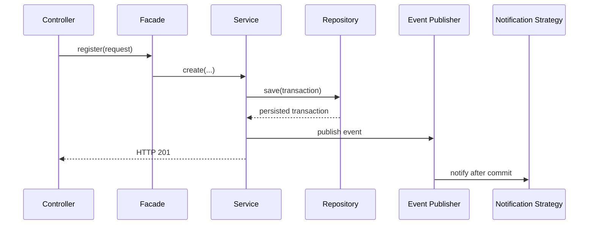

# Arquitetura e padrões

| Padrão | Papel e motivo |
|---|---|
| Facade | oferece uma entrada simples para o fluxo de cadastro |
| Strategy | isola os canais de notificação e permite novas implementações |
| Factory | seleciona a Strategy sem condicionais no consumidor |
| Observer | desacopla persistência e notificação por evento de domínio |
| Repository | abstrai armazenamento e consultas JPA |

A notificação é disparada `AFTER_COMMIT`: uma transação que sofreu rollback não gera efeito externo enganoso.
